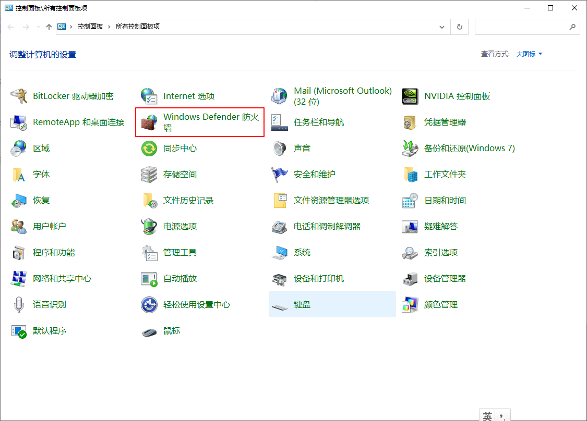
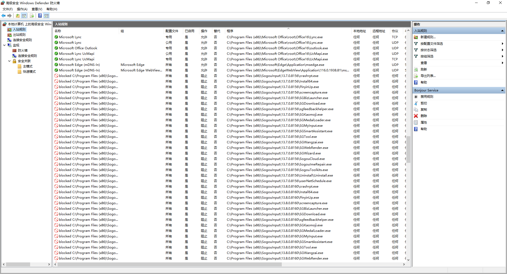
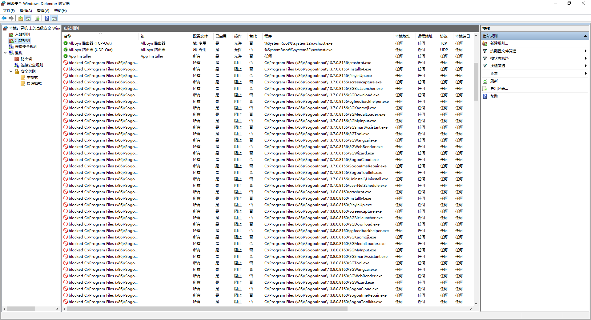
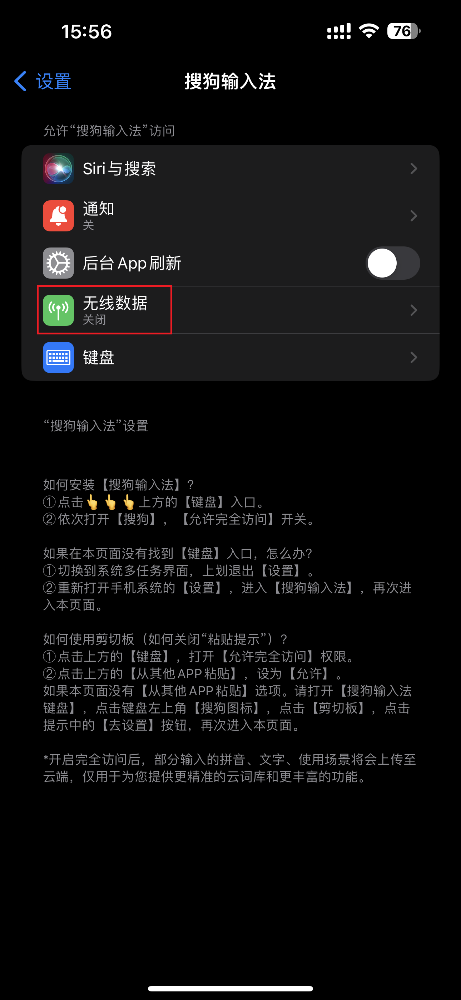

# 建立网络防火墙，阻止搜狗输入法使用网络

你可能低估了输入法的风险，去搜一下“搜狗输入法 安全”吧

[人民网：这些被下架的输入法该醒醒了](http://opinion.people.com.cn/n1/2021/0616/c431649-32132196.html)

[网安：搜狗输入法有严重漏洞 请立即升级](https://www.wangan.com/p/11v78fa939048b1d)

[蓝点网：7年后搜狗输入法依然存在严重问题 上传用户输入内容且加密系统可被监听](https://www.landiannews.com/archives/99829.html)

担心输入法收集您的个人隐私么？试试这个工具，一键阻断输入法使用网络，保护您的个人隐私。

### Windows

适用于Win10，Win11

使用方法

1. 先安装搜狗输入法，更新到最新版本，设置好皮肤等一切。
2. 以管理员身份运行 `run.ps1`，输入您的搜狗输入法目录，一般是：`C:\Program Files (x86)\SogouInput`，可以直接回车，执行完毕后您的搜狗输入法将不再联网。
4. 如果您想继续让输入法联网，可以以管理员身份运行`uninstall.ps1`，输入您的搜狗输入法目录，一般是：`C:\Program Files (x86)\SogouInput`，可以直接回车，执行完毕后您的搜狗输入法的网络即可恢复联网。

如果您打开控制面板的Windows Defender 防火墙

会发现对C:\Program Files (x86)\SogouInput里面的所有可执行文件，创建了一系列入站规则，防止外网数据流入

创建了一系列出站规则，防止内网数据流出

因为禁用了网络，此时您的今日输入不会更新到您其他电脑上

因为禁用了网络，输入法升级会失败

如果想取消，删除这些入站规则和出站规则即可。

### iPhone

如果您用的是苹果手机，在设置->搜狗输入法，关闭无线数据即可

