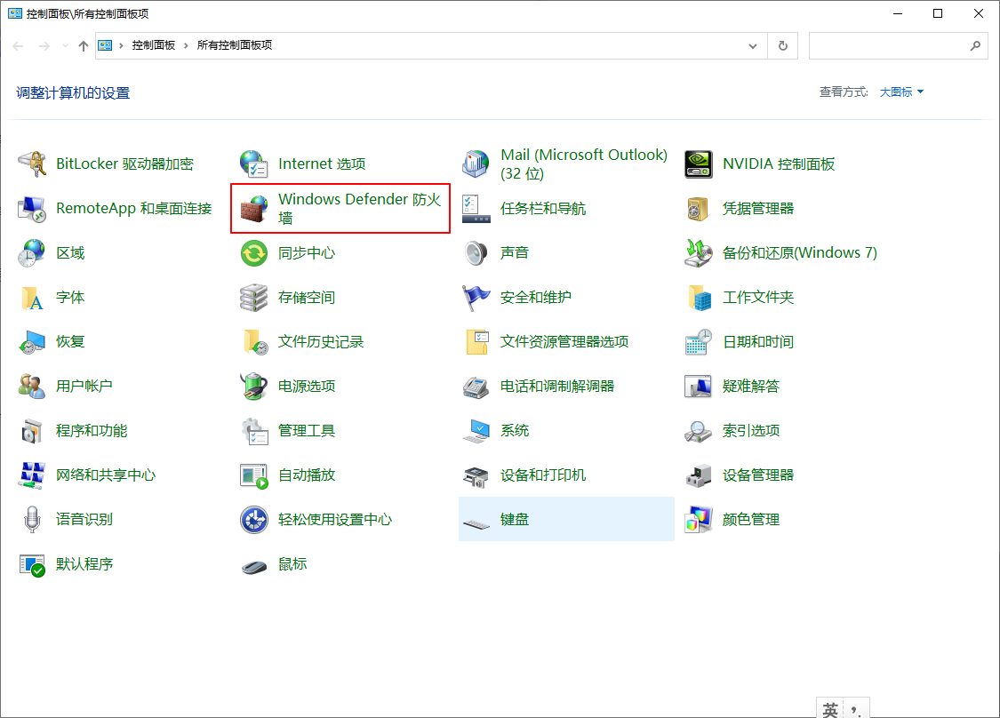
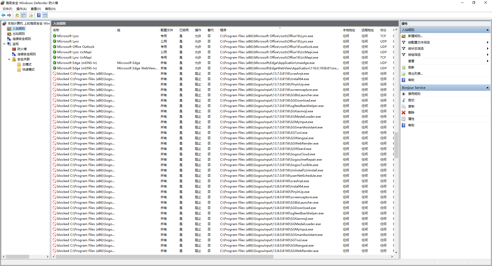
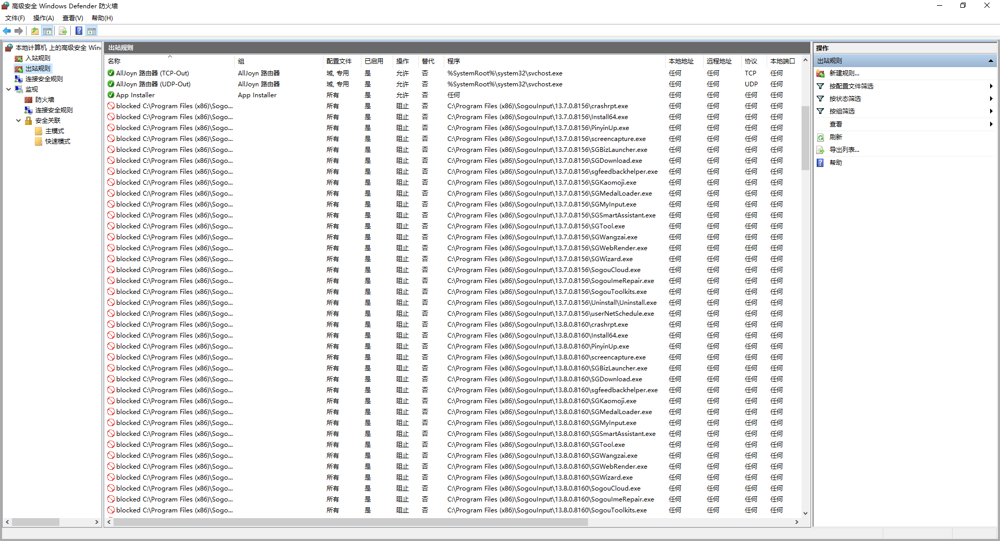
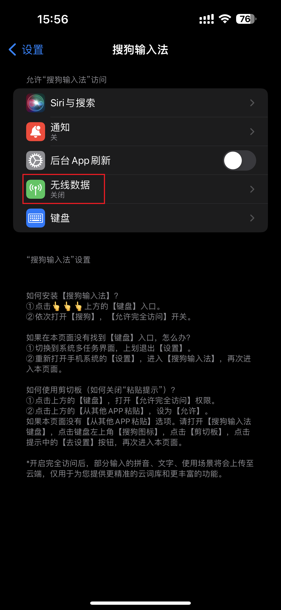

# 建立网络防火墙，阻止搜狗输入法使用网络

你可能低估了输入法的风险，去搜一下“搜狗输入法 安全”吧

[人民网：这些被下架的输入法该醒醒了](http://opinion.people.com.cn/n1/2021/0616/c431649-32132196.html)

[网安：搜狗输入法有严重漏洞 请立即升级](https://www.wangan.com/p/11v78fa939048b1d)

[蓝点网：7 年后搜狗输入法依然存在严重问题 上传用户输入内容且加密系统可被监听](https://www.landiannews.com/archives/99829.html)

担心输入法收集您的个人隐私么？试试这个工具，一键阻断输入法使用网络，保护您的个人隐私。

### Windows

适用于 Win10，Win11

#### 使用方法

1. 先安装搜狗输入法，更新到最新版本，设置好皮肤等一切。
2. 以管理员身份运行 `run.ps1`，按提示输入搜狗输入法目录（一般是 `C:\Program Files (x86)\SogouInput`），直接回车使用默认路径。执行完毕后搜狗输入法将不再联网。
3. 如需恢复联网，以管理员身份运行 `uninstall.ps1`，脚本会自动删除所有本工具创建的防火墙规则，无需输入任何路径。

#### 高级用法

```powershell
# 仅阻断出站流量（不阻断入站）
.\run.ps1 -DirectionMode OutboundOnly

# 指定自定义目录
.\run.ps1 -MainFolder "D:\SogouInput"

# 同时指定额外目录（覆盖默认的 ExtraFolders）
.\run.ps1 -ExtraFolders @('C:\Windows\SysWOW64\IME\SogouPY', 'D:\OtherSogouDir')
```

#### 防火墙规则管理

所有由 `run.ps1` 创建的规则均归入分组 **`DisableSogouNetwork`**，可在
「Windows Defender 防火墙 → 高级安全设置」中按分组筛选查看，也可通过以下 PowerShell 命令管理：

```powershell
# 查看所有已创建的规则
Get-NetFirewallRule -Group 'DisableSogouNetwork'

# 手动批量删除所有规则
Remove-NetFirewallRule -Group 'DisableSogouNetwork'
```

重复运行 `run.ps1` 不会导致规则膨胀——每次运行前会自动清除同组旧规则再重新创建。

如果您打开控制面板的 Windows Defender 防火墙



会发现对 C:\Program Files (x86)\SogouInput 里面的所有可执行文件，创建了一系列入站规则，防止外网数据流入



创建了一系列出站规则，防止内网数据流出



因为禁用了网络，此时您的今日输入不会更新到您其他电脑上


因为禁用了网络，输入法升级会失败


如果想取消，运行 `uninstall.ps1` 即可一键清除所有阻断规则。

### iPhone

如果您用的是苹果手机，在设置->搜狗输入法，关闭无线数据即可




**如果您在Windows上使用了 v2rayN，脚本默认会额外创建防火墙规则，阻止搜狗输入法通过本机 IPv4（127.0.0.1）和 IPv6（::1）回环地址连接代理端口（默认阻断 10808、10811、10812、10813），防止其借助本地代理绕过拦截。重新运行 `run.ps1` 即可使该规则生效。**

**如果您在Windows上使用了clash进行网络代理，需要进行如下设置，否则拦截可能无效。感谢[TNTCompany](https://github.com/TNTCompany)提供解决方法**


然后随便写一个，让它找不到真正的代理就可以。


然后测试一下，它就没办法更新了。


#### 热心老板请我喝杯咖啡，请随意！

|  |  |
| ------------------------------------------- | ----------------------------------- |

**如果你觉得这个工具有用，麻烦请 Star，如果您有意见或者建议，欢迎提 Issue！**

您的支持是我坚持的动力，感谢！

## Star History

[](https://www.star-history.com/#yongxin-ms/DisableSogouNetwork&Date)


## 以下是开源项目的赞助名单：

| 赞助时间                    | 赞助人 | 赞助金额 | 赞助渠道&留言                                               |
| --------------------------- | ------ | -------- | ----------------------------------------------------------- |
| 2025 年 3 月 27 日 09:38:42 | 阿游   | **6.66** | **微信赞赏码：感谢大佬分享，把这输入法治得服服帖帖 😍**      |
| 2025-06-12 11:25:48         | 鸣     | 10.00    | 微信赞赏码：(๑• . •๑)                                       |
| 2025-09-06 22:13:45         | ***    | 6.66     | 支付宝收钱码：非常感谢!麻烦不要把我挂github上               |
| 2025-10-14 17:24:21         | 枫叶岚 | 5.00     | 微信赞赏码：感谢好兄弟的脚本😍这下可以舒舒服服用了，不然膈应 |
|                             |        |          |                                                             |

[](https://dartnode.com "Powered by DartNode - Free VPS for Open Source")
